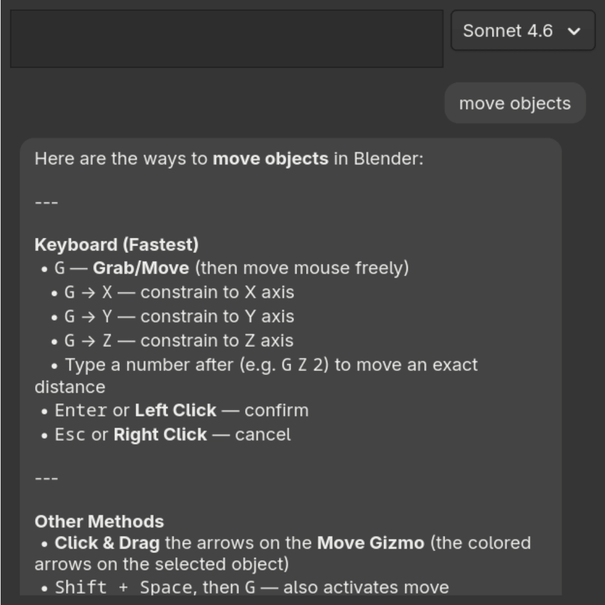

# Quick Help

A tiny native Linux app that gives you instant AI help about whatever application you're currently using. Press a keyboard shortcut, type your question, get a concise answer.

It's essentially an LLM wrapper which provides:
- A quick, minimal interface, with everything keyboard accessible
- Information about your OS and currently focused window is provided to the LLM, so you never need to ask "in Blender, how do I move items" - just ask "move objects"
- Can search the web and fetch pages when it needs up-to-date information
- Attach images with drag-and-drop or pasting from clipboard

There's deliberately no history, since this app is designed for quick requests AI help. A chat history of a few hundred "how to do this" chats is not useful.

This application has been specifically built for my own environment, Fedora with GNOME. If you'd like your own distro supported, create a GH issue.



*Disclaimer: this codebase is vibe-coded, but I use the application personally, and am on-top of any bugs and UI concerns* ... well, I will be, the UI is a bit rough right now, but it's functional.

## Build and Install

* Install the [window-calls](https://github.com/ickyicky/window-calls) GNOME extension, which is used to detect the currently focused window.

* **(Optional, for screenshots)** Install `gnome-screenshot`

```bash
# Fedora
sudo dnf install gnome-screenshot
```

Then install the [allow-gnome-screenshot](https://github.com/siddhpant/allow-gnome-screenshot) GNOME extension, since screenshotting is blocked under wayland.

* Install 3rd party deps GTK4, libcurl, json-glib, and meson.

```bash
# Fedora
sudo dnf install gtk4-devel libcurl-devel json-glib-devel meson ninja-build
```

* Build it

```bash
meson setup build
ninja -C build
```

* Generate an Anthropic API key [here](https://console.anthropic.com/settings/keys) and set the `ANTHROPIC_API_KEY` environment variable. Note that if you launch via a GNOME shortcut, the shortcut runs from the systemd user session, not your shell, so an `export` in `.bashrc`/`.zshrc` won't be visible.

* **(Optional)** Web search is available out of the box via Anthropic's built-in search. If you'd prefer to use Brave Search instead (free tier: 2,000 queries/month), generate a key [here](https://brave.com/search/api/) and set `BRAVE_SEARCH_API_KEY`.

* Add a custom shortcut under **Settings > Keyboard > Custom Shortcuts** and set the command to the full path of the binary. eg. `/home/you/Applications/quick-help/build/quick-help`

## CLI Flags

* `--no-decorations` - hides window decorations (title bar)
* `--screenshot` / `-s` - capture and attach a screenshot of the focused window (requires `gnome-screenshot` and the `allow-gnome-screenshot` extension)
* `--model` / `-m` - Default model ID. Possible values `claude-sonnet-4-6`, `claude-haiku-4-5-20251001`, `claude-opus-4-6`

## Keyboard shortcuts

| Shortcut | Action |
| --- | --- |
| `Enter` | Send the question |
| `Shift+Enter` | Insert a newline |
| `Esc` | Close the window |
| `Ctrl+N` | Start a new conversation |
| `Ctrl+V` | Paste image from clipboard (text paste works normally when no image) |
| `Ctrl+L` | Jump back to the input text box |
| `Ctrl+↑` / `Ctrl+↓` | Scroll the response |
| `Ctrl+PgUp` / `Ctrl+PgDn` | Scroll the response by page |
| `Ctrl+Home` / `Ctrl+End` | Scroll to top/bottom of response |
| `Ctrl+Alt+↑` / `Ctrl+Alt+↓` | Jump to previous/next user message |
